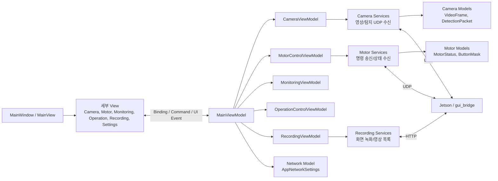

# LIG DNA GUI

Windows WPF 기반 EO/IR 감시 GUI입니다. Jetson/ROS2 `gui_bridge`에서 들어오는 EO/IR 영상, YOLO 탐지 결과, 모터 상태, 녹화 영상 목록을 표시하고, GUI에서 선택한 모터/추적 명령을 Jetson으로 전송합니다.

## 전체 통신 흐름

```text
EO/IR Camera, YOLO, Motor
        |
        v
Jetson / ROS2 / gui_bridge
        |
        |  UDP 6000  : EO JPEG 영상
        |  UDP 6001  : IR JPEG 영상
        |  UDP 6002  : EO/IR YOLO 탐지 결과
        |  UDP 8001  : 모터 상태
        |  HTTP 8090 : 녹화 영상 목록/다운로드
        v
BroadcastControl.App
        |
        |  UDP 8000  : GUI 모터/추적 명령
        v
Jetson / ROS2 Motor Control
```

## MVVM 아키텍처

`MainWindow`가 전체 화면 틀을 만들고, `Views` 폴더의 세부 View가 각 영역 UI를 그립니다. 화면에 표시할 데이터와 버튼 명령은 `MainViewModel`을 통해 바인딩됩니다. `MainViewModel`은 기능별 ViewModel을 소유하고, 각 기능별 ViewModel은 자기 기능에 필요한 Service를 소유합니다.



## Binding / Subscribe / Update / Command

| 흐름 | 위치 | 설명 |
| --- | --- | --- |
| Binding | `Views/*.xaml` -> `MainViewModel` | 화면 텍스트, 이미지, 상태, 리스트, 버튼 활성 여부를 표시합니다. |
| Subscribe | 기능별 ViewModel의 Service | 카메라 영상, YOLO 탐지 결과, 모터 상태 수신 서비스를 실행합니다. |
| Update | `MainViewModel`과 기능별 ViewModel | 수신한 Model 데이터를 화면 표시용 속성으로 바꾸고 `PropertyChanged`로 View를 갱신합니다. |
| Command | View 버튼/키 입력 -> ViewModel/Service | 모터 이동, Motor Speed 변경, 녹화, 네트워크 설정 저장, 테마/언어 변경을 처리합니다. |
| Link | `MainWindow.xaml`, `MainViewModel` | 세부 View를 화면에 올리고 세부 ViewModel과 Service 계층을 연결합니다. |

## 주요 폴더

| 경로 | 역할 |
| --- | --- |
| `BroadcastControl.App/Views` | 기능별 WPF UserControl 화면 |
| `BroadcastControl.App/ViewModels` | 화면 상태, Command, 기능별 Service 소유 계층 |
| `BroadcastControl.App/Models` | UDP/HTTP/설정/상태 데이터 구조 |
| `BroadcastControl.App/Services` | 영상 수신, 모터 통신, 녹화, 네트워크 처리 |
| `BroadcastControl.App/Infrastructure` | 공통 WPF 유틸리티 |
| `JetsonThor.RosCameraBridge` | Jetson ROS2 데이터를 GUI UDP/HTTP로 변환하는 브릿지 |
| `BroadcastControl.UdpBenchmark` | UDP 수신 성능 확인 도구 |

## BroadcastControl.App 구조

```text
BroadcastControl.App/
  App.xaml
  App.xaml.cs
  MainWindow.xaml
  MainWindow.xaml.cs

  Infrastructure/
    RelayCommand.cs

  Views/
    Camera/
    Monitoring/
    Motor/
    Operation/
    Recording/
    Settings/

  ViewModels/
    MainViewModel.cs
    ViewModelBase.cs
    Camera/
    Monitoring/
    Motor/
    Operation/
    Recording/

  Services/
    Camera/
    Monitoring/
    Motor/
    Network/
    Recording/

  Models/
    Camera/
    Motor/
    Network/
```

## ViewModel 역할

| 파일 | 역할 |
| --- | --- |
| `ViewModels/MainViewModel.cs` | 루트 ViewModel입니다. 세부 ViewModel을 소유하고 공통 상태, Command, 로그, 언어/테마 상태를 제공합니다. |
| `ViewModels/ViewModelBase.cs` | `INotifyPropertyChanged`와 `SetProperty`를 제공하는 공통 기반 클래스입니다. |
| `ViewModels/Camera/CameraViewModel.cs` | EO/IR 영상 수신 서비스와 YOLO 탐지 결과 수신 서비스를 소유하고, 줌/회전/밝기/대비 상태를 관리합니다. |
| `ViewModels/Monitoring/MonitoringViewModel.cs` | System Status, YOLO Targets, 시스템 로그 표시 데이터를 관리하고, YOLO 위험도 기반 추적 대상 ID를 갱신합니다. |
| `ViewModels/Motor/MotorControlViewModel.cs` | 모터 명령 송신 서비스와 모터 상태 수신 서비스를 소유하고 Pan/Tilt, 방향키, 각도 입력, Motor Speed를 관리합니다. |
| `ViewModels/Operation/OperationControlViewModel.cs` | Scan/Manual 모드, Tracking, 주 탐지체, 테마, 언어, 네트워크 설정 상태를 관리합니다. |
| `ViewModels/Recording/RecordingViewModel.cs` | 수동 화면 녹화 서비스와 녹화 상태, 녹화 영상 목록 표시 상태를 관리합니다. |

## Service 역할

| 파일 | 역할 |
| --- | --- |
| `Services/Camera/UdpEncodedVideoReceiverService.cs` | EO/IR JPEG UDP 프레임을 수신, 조립, 디코딩하고 YOLO 탐지/status 패킷을 파싱합니다. |
| `Services/Camera/DetectionOverlayService.cs` | 영상 표시 영역 기준 바운딩 박스 좌표를 계산합니다. |
| `Services/Motor/UdpMotorControlService.cs` | GUI에서 Jetson으로 모터/추적 UDP 명령을 전송합니다. |
| `Services/Motor/MotorPacketSerializer.cs` | 모터 명령 값을 Jetson 규격의 UDP 패킷으로 직렬화합니다. |
| `Services/Motor/UdpMotorStatusReceiverService.cs` | Jetson 모터 상태 UDP 패킷을 수신하고 파싱합니다. |
| `Services/Recording/ViewportRecordingService.cs` | GUI 카메라 표시 영역을 AVI 파일로 녹화합니다. |
| `Services/Network/UdpReceiverService.cs` | 범용 UDP 수신 기능을 제공합니다. |
| `Services/Network/UdpSenderService.cs` | 범용 UDP 송신 기능을 제공합니다. |
| `Services/Monitoring/SystemLogService.cs` | 시스템 로그 이벤트를 전달합니다. |

## 통신 포트

| 포트 | 방향 | 기능 |
| --- | --- | --- |
| `6000/udp` | Jetson -> GUI | EO JPEG 영상 프레임 |
| `6001/udp` | Jetson -> GUI | IR JPEG 영상 프레임 |
| `6002/udp` | Jetson -> GUI | EO/IR YOLO 탐지 결과 |
| `8000/udp` | GUI -> Jetson | 모터/추적 명령 |
| `8001/udp` | Jetson -> GUI | 모터 상태 |
| `8090/http` | Jetson -> GUI | 녹화 영상 목록/다운로드 |

## 영상 수신 형식

EO/IR 영상은 raw image가 아니라 JPEG로 압축된 프레임입니다. Jetson 브릿지가 각 프레임을 JPEG로 인코딩한 뒤 UDP 청크로 나누어 보내고, GUI가 같은 frame id의 청크를 모아 JPEG를 복원한 다음 WPF 이미지로 표시합니다.

```text
ROS Image
  -> JPEG 압축
  -> UDP 청크 분할
  -> GUI UDP 수신
  -> JPEG 조립/디코딩
  -> View 표시
```

## 모터 명령 패킷

GUI는 Jetson의 `8000/udp`로 모터 명령 패킷을 보냅니다. Pan/Tilt 각도는 GUI에서 degree로 표시하지만 전송 시 raw step으로 변환됩니다.

```text
raw = deg / 360.0 * 4096.0
```

최종 전송값은 `0~4095` 범위로 제한합니다.

## 빌드

```powershell
dotnet build BroadcastControl.slnx -c Debug
```

이미 패키지가 복원된 상태에서 빠르게 확인할 때는 다음 명령을 사용할 수 있습니다.

```powershell
dotnet build BroadcastControl.slnx -c Debug --no-restore
```
